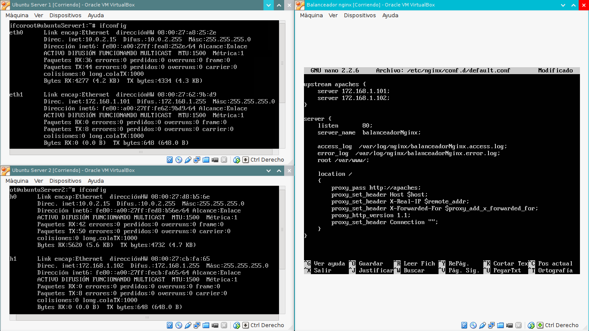
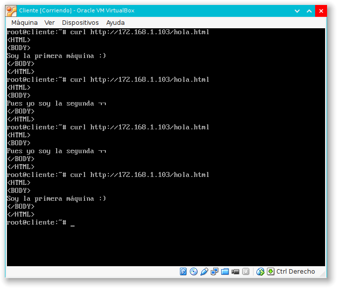
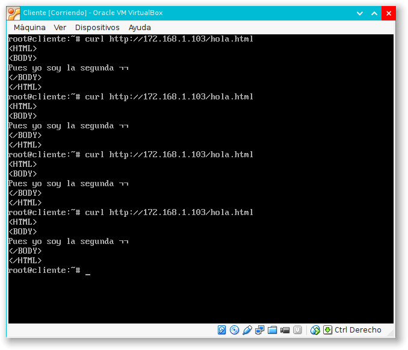
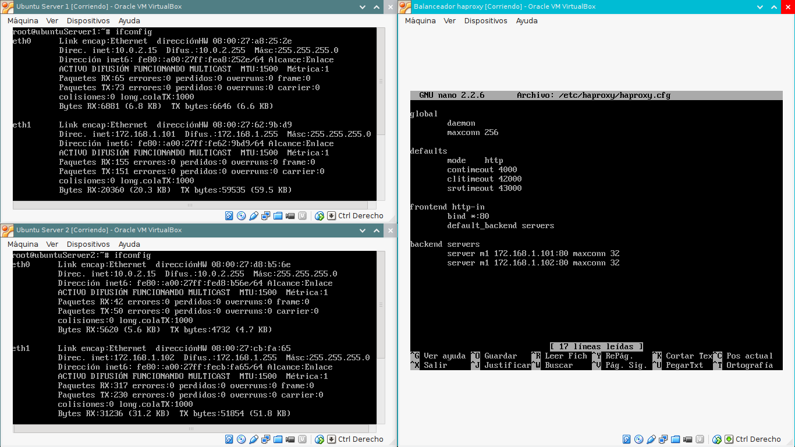

#Práctica 1

##nginx

###Instalación

Clonar una de las máquinas creadas en la práctica 2, asegurándonos de tener marcada la opción "Reinicializr la dirección MAC de todas las tarjetas de red". 

Desactivar Apache con la órden `update-rc.d -f apache2 remove`

Para poder instalar nginx, debemos realizar unos pasos previos:

**Importar la clave del repositorio**

Ejecutamos las siguientes órdenes:

```
cd /tmp/
wget http://nginx.org/keys/nginx_signing.key
apt-key add /tmp/nginx_signing.key
rm -f /tmp/nginx_signing.key
```

**Añadimos el repositorio al fichero `/etc/apt/sources.list`**

Ejecutamos las siguientes órdenes

```
echo "deb http://nginx.org/packages/ubuntu/ lucid nginx" >> /etc/apt/sources.list
echo "deb-src http://nginx.org/packages/ubuntu/ lucid nginx" >> /etc/apt/sources.list
```

**Instalación del paquete**

Ejecutamos las siguientes órdenes:

```
apt-get update
apt-get install nginx
```

###Configuración

Para configurar nginx, tenemos que editar el archivo `/etc/nginx/conf.d/default.conf`, de manera que quede así (*en negrita se indican los campos que hay que modificar en cada caso: las IPs de los servidores y el nombre del balanceador, si así se estima oportuno*):

```
upstream apaches {
	server **172.168.1.101**;
	server **172.168.1.102**;
}

server{
	listen		80;
	server_name **balanceadorNginx**;

	access_log /var/log/nginx/**balanceadorNginx**.access.log;
	error_log /var/log/nginx/**balanceadorNginx**.error.log;
	root /var/www/;
	
	location /
	{
		proxy_pass http://apaches;
		proxy_set_header Host $host;
		proxy_set_header X-Real-IP $remote_addr;
		proxy_set_header X-Forwarded-For $proxy_add_x_forwarded_for;
		proxy_http_version 1.1;
		proxy_set_header Connection "";
	}
}
```



### Ejecución

Para que nuestro balanceador empiece a escuchar en el puerto que le hemos indicado, basta con ejecutar la orden `service nginx restart`

Podemos ya probar el funcionamiento de nuestro balanceador. Una manera sencilla de hacerlo es ejecutar repetidamente la orden `curl http://172.168.1.103/hola.html` desde una cuarta máquina cliente. Con esta orden, lo que hacemos es solicitar la página hola.html al balanceador (cuya ip es `172.168.1.103`) y vemos que nos muestra alternativamente la de una u otra máquina servidora.


Podemos probar distintas configuraciones. Por ejemplo, podemos dar más importancia a una máquina que otra, modificando las líneas del upstream del archivo `/etc/nginx/conf.d/default.conf` de manera que queden así:

```
upstream apaches {
	server 172.16.168.130 weight=1;
	server 172.16.168.131 weight=2;
} 
```

Tras ejecutar `service nginx restart` podemos volver a ejecutar nuestro sencillo test con `curl` desde una máquina cliente:



Una configuración más interesante es aquella que, a cada IP, le asigna el mismo servidor, de manera que aplicaciones que necesiten de informaciones personalizadas puedan trabajar bien. La configuración sería así

```
upstream apaches {
	ip_hash;
	server 172.16.168.130;
	server 172.16.168.131;
} 
```

Y se comporta tal como se espera:



##haproxy

###Instalación

Clonamos la máquina del balanceador anterior, asegurándonos de tener marcada la opción "Reinicializar la dirección MAC de todas las tarjetas de red". Tras desinstalar nginx y ajustar la IP de la máquina para que no haya conflictos con las que ya tenemos instaladas, podemos instalar haproxy con la siguiente orden:

```
apt-get install haproxy
```

###Configuración

Para configurar haproxy, tenemos que editar el archivo `/etc/haproxy/haproxy.cfg`, de manera que quede de la siguiente manera:

```
global
	daemon
	maxconn 256

defaults
	mode http
	contimeout
	4000
	clitimeout
	42000
	srvtimeout
	43000

frontend http-in
	bind *:80
	default_backend servers

backend servers
	server m1 172.168.1.101:80 maxconn 32
	server m2 172.168.1.102:80 maxconn 32
```



### Ejecución

Para que nuestro balanceador empiece a escuchar en el puerto que le hemos indicado, basta con ejecutar la orden

```
/usr/sbin/haproxy -f /etc/haproxy/haproxy.cfg
```

Podemos ya probar el funcionamiento de nuestro balanceador. Como antes, podemos ejecutar ejecutar repetidamente la orden `curl http://172.168.1.104/hola.html` (*la IP de esta nueva máquina balanceadora es la 172.168.1.104*) desde nuestra máquina cliente. Vemos que, como antes, la respuesta se alterna entre la primera y la segunda máquina.


----
Alejandro García Montoro.
