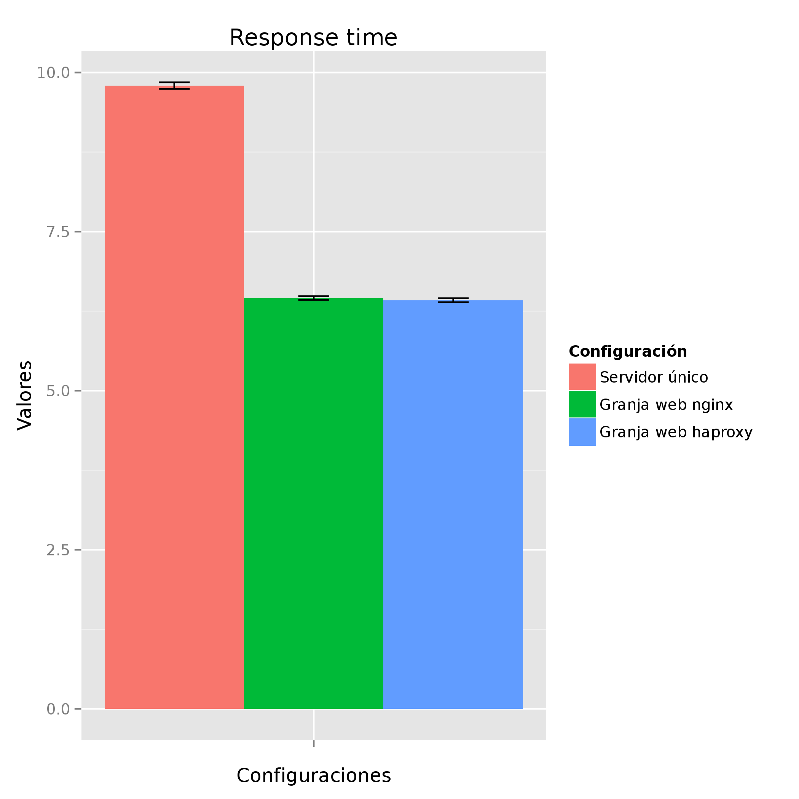

#Práctica 4

En esta práctica probaremos distintas configuraciones de red con varios paquetes software dedicados a testear servidores web.

Lo primero que tenemos que hacer es dejar las configuraciones del nginx y el haproxy como las pusimos al principio de la práctica 3:

* En el balanceador nginx modificamos el archivo `/etc/nginx/conf.d/default.conf` de manera que la parte de `upstream apaches` quede así:
```
upstream apaches {
	server 172.168.1.101;
	server 172.168.1.102;
}
```

* En el balanceador haproxy modificamos el archivo `/etc/haproxy/haproxy.cfg` de manera que la parte de `backend servers` quede así:
```
backend servers
	server m1 172.168.1.101:80 maxconn 32
	server m2 172.168.1.102:80 maxconn 32
```

Tras resetear ambos balanceadores, con `service nginx restart` el primero y con `/usr/sbin/haproxy -f /etc/haproxy/haproxy.cfg` el segundo, podemos empezar la práctica.

##Instalación

Para hacer los tests instalaremos Apache Benchmark, Siege y OpenWebLoad en la máquina cliente. Estos paquetes están en los repositorios, y podemos descargar e instalar los tres a la vez con la siguiente orden:

```
apt-get install apache2-utils siege openload
```

##Benchmarks

Es necesario tener PHP instalado y configurado para que Apache lo use; con el objetivo de sobrecargar los servidores, usaremos el siguiente [script](./Scripts/benchmark.php) con un bucle que realiza un millón de iteraciones:

```php
<?php

$tiempo_inicio = microtime(true);

for ($i=0; $i<1000000; $i++){
	$a = $i * $i;
	$b = $a - $i;
	$c = $a / ($b+1);
	$d = 1 / ($c+1);
}

$tiempo_fin = microtime(true);

echo "Tiempo empleado: " . round($tiempo_fin - $tiempo_inicio, 4) ; 

?>
```

En nuestra máquina PHP ya estaba instalado y configurado (recordemos que la clonamos directamente de una de las máquinas servidoras), así que sólo ha sido necesario programar los tests y ejecutarlos.

La idea del benchmark que vamos a hacer es la siguiente: realizaremos diez ejecuciones con cada una de las tres herramientas sobre las tres configuraciones de red siguientes:

1. Servidor único
2. Granja web con dos servidores finales y un balanceador nginx
3. Granja web con dos servidores finales y un balanceador haproxy

El [script](./Scripts/script.sh) para ejecutar todas las herramientas con cada una de las tres configuraciones es el siguiente:

```bash
#!/bin/bash

function test_apache_benchmark {
	AB_SALIDA=`ab -n 1000 -c 15 http://$1/benchmark.php | grep -E 'Time taken for tests|Failed requests|Requests per second|Time per request' | grep -E -o '[0-9.]*'`

	AB_TIME_TESTS=`echo $AB_SALIDA | cut -d ' ' -f1`
	AB_FAILED=`echo $AB_SALIDA | cut -d ' ' -f2`
	AB_REQ_SECONDS=`echo $AB_SALIDA | cut -d ' ' -f3`
	AB_TIME_REQ=`echo $AB_SALIDA | cut -d ' ' -f4`

	echo "$AB_TIME_TESTS,$AB_FAILED,$AB_REQ_SECONDS,$AB_TIME_REQ" >> $2
	echo
	echo "###############################################"
	echo "# DEBUG: APACHE BENCHMARK TERMINADO           #"
	echo "###############################################"
	echo
}

function test_openwebload {
	OL_SALIDA=`openload -o CSV -l 60 http://$1/benchmark.php 15`
	
	OL_TOTAL_TPS=`echo $OL_SALIDA | cut -d ',' -f3`
	OL_AVG_TIME=`echo $OL_SALIDA | cut -d ',' -f4`
	OL_MAX_TIME=`echo $OL_SALIDA | cut -d ',' -f5`

	echo "$OL_TOTAL_TPS,$OL_AVG_TIME,$OL_MAX_TIME" >> $2

	echo
	echo "###############################################"
	echo "# DEBUG: OPENWEBLOAD TERMINADO                #"
	echo "###############################################"
	echo
}

function test_siege {
	SI_SALIDA=`siege -b -c 15 -t60S -v http://$1/benchmark.php 2>&1 >/dev/null | grep -E 'Availability|Elapsed time|Response time|Transaction rate|Failed transactions|Longest transaction' | grep -E -o '[0-9.]*'`
	
	SI_AVAILABILITY=`echo $SI_SALIDA | cut -d ' ' -f1`
	SI_ELAPSED=`echo $SI_SALIDA | cut -d ' ' -f2`
	SI_RESP_TIME=`echo $SI_SALIDA | cut -d ' ' -f3`
	SI_TRANS_RATE=`echo $SI_SALIDA | cut -d ' ' -f4`
	SI_FAILED_TRANS=`echo $SI_SALIDA | cut -d ' ' -f5`
	SI_LONGEST_TRANS=`echo $SI_SALIDA | cut -d ' ' -f6`

	echo "$SI_AVAILABILITY,$SI_ELAPSED,$SI_RESP_TIME,$SI_TRANS_RATE,$SI_FAILED_TRANS,$SI_LONGEST_TRANS" >> $2

	echo
	echo "###############################################"
	echo "# DEBUG: SIEGE TERMINADO                      #"
	echo "###############################################"
	echo
}

IP_MAQUINA1=172.168.1.101
IP_BALANCEADOR_NGINX=172.168.1.103
IP_BALANCEADOR_HAPROXY=172.168.1.104

IPs=( $IP_MAQUINA1 $IP_BALANCEADOR_NGINX $IP_BALANCEADOR_HAPROXY )

FILES_AB=( ab_servidor.csv ab_nginx.csv ab_haproxy.csv )
FILES_OL=( ol_servidor.csv ol_nginx.csv ol_haproxy.csv )
FILES_SI=( si_servidor.csv si_nginx.csv si_haproxy.csv )

for i in `seq 0 2`
do
	rm ${FILES_AB[$i]} ${FILES_OL[$i]} ${FILES_SI[$i]}
	for j in `seq 1 10`
	do
		test_apache_benchmark ${IPs[$i]} ${FILES_AB[$i]}
		test_openwebload  ${IPs[$i]} ${FILES_OL[$i]}
		test_siege  ${IPs[$i]} ${FILES_SI[$i]}
	done
done
```
La idea es sencilla: asociada a cada una de las tres herramientas, existe una función cuyos objetivos son:

* Ejecutar el benchmark asociado
* Obtener los datos que se necesitan en cada caso
* Escribir los datos en un archivo CSV de manera que después se pueda tratar con facilidad por cualquier otra herramienta que manipule los datos.

Cada función recibe dos parámetros:

1. La IP de la máquina sobre la que ejecutar el benchmark.
2. El archivo sobre el que volcar los datos una vez extraídos y organizados.

Así, nos facilitamos el trabajo posterior. El núcleo del programa se compone entonces de dos bucles anidados, con los que se itera sobre las IPs (la de una máquina servidora sola, la del balanceador nginx y la del balanceador haproxy), haciendo para cada una de ellas diez repeticiones. En cada iteración, se llama sucesivamente a las tres funciones implementadas, pasándoles como argumento la IP actual y el archivo asociado en el que escribir la salida.

Además, esta ha sido una buena oportunidad para aprender a usar `R`, así que la manipulación de los datos, la extracción de las medias y los errores y la creación de las gráficas se ha realizado con el siguiente [script](Scripts/extraerGraficasPorBenchmark.R) escrito en ese lenguaje de programación:

```R
library(plotrix)
library(ggplot2)
library(reshape2)
library(plyr)

argumentos <- commandArgs(trailingOnly = TRUE)

datosRaw <- ldply( argumentos[1:3], function(archivo){
	data.frame(read.csv(archivo, header=TRUE), ID=archivo)
})

datos <- melt(datosRaw,id.vars="ID")

datosResumidos <- ddply(
	datos,
	c("ID","variable"),
	summarise,
	mean=mean(value),
	sd=sd(value),
	se=std.error(value)
)

campos <- unique(datosResumidos$variable)

graficos <- lapply(campos, function(campo){

	ggplot(subset(datosResumidos, variable==campo), aes(x=variable, y=mean, fill=ID)) + 

	    geom_bar(position=position_dodge(), stat="identity") +

	    geom_errorbar(
	    	aes(ymin=mean-se, ymax=mean+se),
	        width=.2,
	        position=position_dodge(.9)
	    ) +

	    xlab("Configuraciones") +
	    ylab("Valores") +

		scale_x_discrete(labels="") +

    	ggtitle(gsub("\\."," ",campo)) +

	    scale_fill_hue(	name="Configuración",
                   		labels=c("Servidor único", "Granja web nginx", "Granja web haproxy") )

	prefijo <- argumentos[4]
	ggsave(sprintf("../IMGs/%s/%s%s.png",prefijo,prefijo,campo))

})
```
A continuación se detallan cada uno de los benchmarks realizados y los datos obtenidos (las medidas extraídas se pueden encontrar en la carpeta [Datos](./Datos/))

###Apache Benchmark
La orden principal en la función `test_apache_benchmark` es la siguiente

```
ab -n 1000 -c 15 http://IP/benchmark.php
```

Donde `IP` itera sobre las IPs de las tres configuraciones que queremos testear, la de una máquina servidora sola, la de una granja web con dos máquinas finales y un balanceador nginx y la de una granja web con dos máquinas finales y un balanceador haproxy.

Los dos parámetros usados son:

* `-n 1000`: Se realizan 1000 peticiones.
* `-c 15  `: Se simulan quince clientes concurrentes.

Con esta herramienta se han obtenido los siguientes datos:

* Número de peticiones fallidas
* Número de peticiones por segundo
* Tiempo por petición
* Tiempo total en ejecutar el benchmark

Las gráficas asociadas a cada una de las medidas son:


###Openwebload
La orden principal en la función `test_openwebload` es la siguiente

```
openload -o CSV -l 60 http://IP/benchmark.php 15
```

Donde `IP` itera sobre las IPs de las tres configuraciones que queremos testear, la de una máquina servidora sola, la de una granja web con dos máquinas finales y un balanceador nginx y la de una granja web con dos máquinas finales y un balanceador haproxy.

Los tres parámetros usados son:

* `-o CSV`: La salida se da en formato CSV; facilita la manipulación de los datos
* `-l 60 `: El benckmark se ejecuta durante 60 segundos
* `15    `: Se simulan quince clientes concurrentes

Con esta herramienta se han obtenido los siguientes datos:

* Tiempo medio de respuesta
* Tiempo máximo de respuesta
* Transacciones por segundo

Las gráficas asociadas a cada una de las medidas son:


###Siege
La orden principal en la función `test_siege` es la siguiente

```
siege -b -c 15 -t60S http://IP/benchmark.php
```

Donde `IP` itera sobre las IPs de las tres configuraciones que queremos testear, la de una máquina servidora sola, la de una granja web con dos máquinas finales y un balanceador nginx y la de una granja web con dos máquinas finales y un balanceador haproxy.

Los tres parámetros usados son:

* `-b   `: Siege, por defecto, deja un segundo entre petición y petición. Esta opción lo impide.
* `-c 15`: Se simulan quince clientes concurrentes.
* `-t60S`: El benchmark se ejecuta durante 60 segundos.

Con esta herramienta se han obtenido los siguientes datos:

* Porcentaje de disponibilidad
* Tiempo total en ejecutar el benchmark
* Transacciones fallidas
* Transacción más larga
* Tiempo de respuesta
* Tasa de transacción

Las gráficas asociadas a cada una de las medidas son:





## Conclusiones

A la vista de todas las gráficas, podemos concluir que la mejor de las configuraciones para las medidas extraídas es la de una granja web con un balanceador haproxy.

Sin embargo, hay que tomar con precaución este estudio. Con distintas configuraciones, parámetros o scripts ejecutados en el servidor, la respuesta de cada herramienta puede variar mucho. No es lo mismo ejecutar un bucle de tres millones de iteraciones que servir diez páginas dinámicas diferentes. La respuesta puede mejorar o empeorar según el trabajo realizado.

Para tomar una decisión en un escenario real, habría que adecuar la sobrecarga de los servidores a las condiciones a las que se verán sometidos cuando estén en producción. Además, habría que ajustar los parámetros de cada herramienta de manera que simulen de una forma fiel la concurrencia de clientes a nuestras máquinas.

----
Alejandro García Montoro.