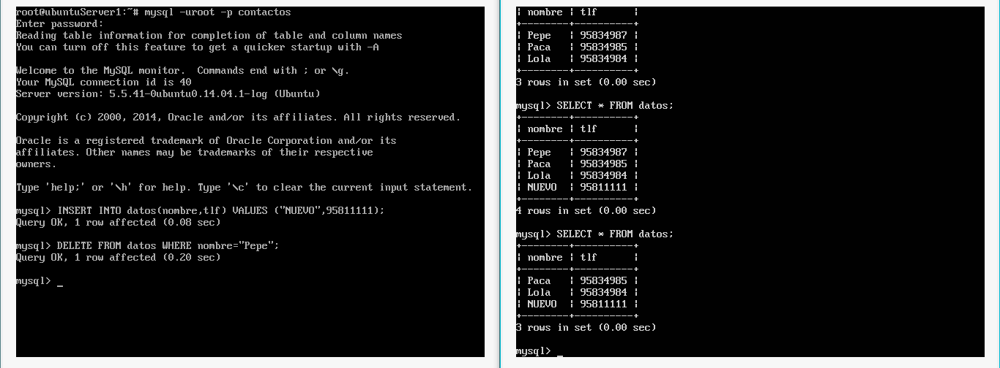

#Práctica 5

## Creación de la base de datos
Con la línea de comandos de MySQL crearemos una base de datos en las dos máquinas servidoras finales con la siguiente orden:

```
mysql -uroot -p
mysql> create database contactos;
```

A partir de ahora trabajaremos sólo en una de las máquinas, para poblar la base de datos con tablas y tuplas que después trasladaremos a la otra máquina. Así, en la primera máquina ejecutamos la siguiente orden

```
mysql -uroot -p contactos < poblarBD.sql
```

Donde `poblarBD.sql` es un [script SQL](./Scripts/poblarBD.sql) con el que crear algunas tablas e insertar algunos datos:

```SQL
CREATE TABLE datos(nombre VARCHAR(100),tlf INT);

INSERT INTO datos(nombre,tlf) VALUES ("Pepe",95834987);
INSERT INTO datos(nombre,tlf) VALUES ("Paca",95834985);
INSERT INTO datos(nombre,tlf) VALUES ("Lola",95834984);
```

La siguiente captura de pantalla muestra el estado de la base de datos tras ejecutar la orden anterior.


##Copia de seguridad manual
Para hacer una copia manual de la base de datos, basta con ejecutar las siguientes órdenes:

```
#Bloqueamos la base de datos
mysql -uroot -p
mysql> FLUSH TABLES WITH READ LOCK;
mysql> quit

#Hacemos la copia de seguridad
mysqldump contactos -uroot -p > contactosDB.sql

#Desbloqueamos la base de datos
mysql -uroot -p
mysql> UNLOCK TABLES;
mysql> quit
```
Se nos crea entonces un fichero, cuyas primeras líneas se listan en la siguiente captura de pantalla, que podemos enviar a la segunda máquina.


Desde la segunda máquina ejecutamos la siguiente orden para recuperar la copia de seguridad de la primera e insertarla en la base de datos:

```
scp root@172.168.1.101:/root/contactosDB.sql contactosDB.sql
mysql -uroot -p contactos < contactosDB.sql
```


##Configuración maestro-esclavo

Para realizar la configuración maestro-esclavo lo primero que tenemos que hacer es modificar los archivos de configuración de mysql en ambas máquinas, `/etc/mysql/my.cnf`, de manera que queden tal y como se ve en la siguiente captura de pantalla, donde se muestran sólo las líneas que hay que modificar 


Creamos ahora un usuario en la base de datos original (la de la primera máquina) al que daremos privilegios de copia, con las siguientes órdenes:

```
mysql -uroot -p
mysql> CREATE USER esclavo IDENTIFIED BY 'esclavo';
mysql> GRANT REPLICATION SLAVE ON *.* TO 'esclavo'@'%' IDENTIFIED BY 'esclavo';
mysql> FLUSH PRIVILEGES;
mysql> FLUSH TABLES;
mysql> FLUSH TABLES WITH READ LOCK;
```


En la segunda máquina, la que actuará como esclava, ejecutamos las siguientes órdenes:

```
mysql -uroot -p
mysql>  CHANGE MASTER TO MASTER_HOST='172.168.1.101',
		MASTER_USER='esclavo', MASTER_PASSWORD='esclavo',
		MASTER_LOG_FILE='mysql-bin.000002', MASTER_LOG_POS=501,
		MASTER_PORT=3306;
mysql> START SLAVE;
```


Para terminar la configuración, desbloqueamos las tablas en la primera máquina:

```
mysql -uroot -p
mysql> UNLOCK TABLES;
```

Si todo ha ido bien, al ejecutar la orden `SHOW STATUS\G` en la máquina esclava, el campo `Seconds_Behind_Master` debe tener un valor distinto de `null`; en este caso, es 0:


Cuando la configuración esté lista, podemos actualizar sin miedo la base de datos de la máquina maestra. Los cambios se reflejarán al instante en la máquina esclava, como vemos en la siguiente captura de pantalla; en este ejemplo, se insertan y borran tuplas desde la primera máquina y se imprimen desde la segunda, donde comprobamos que las actualizaciones se realizan automáticamente:



----
Alejandro García Montoro.