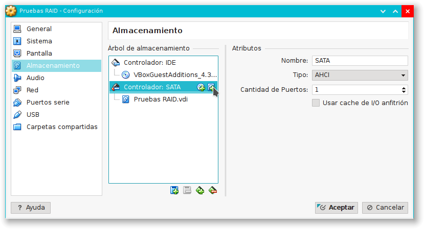
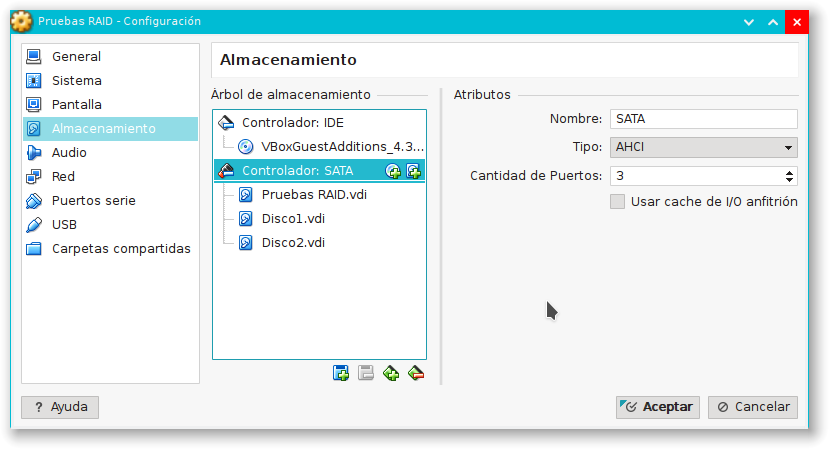
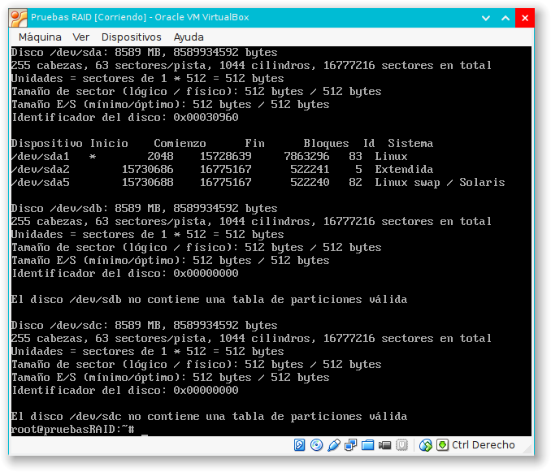
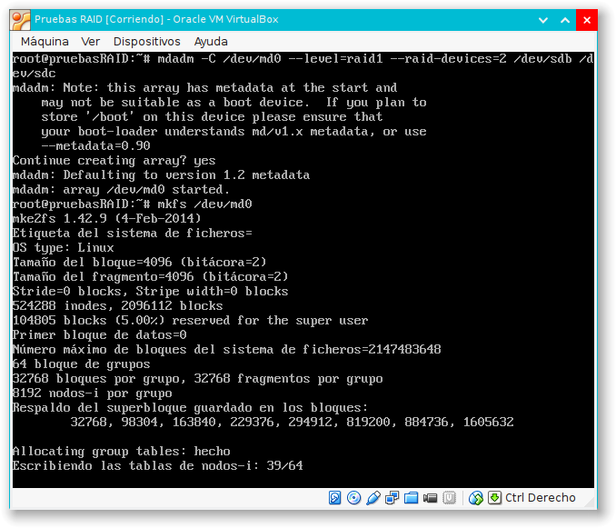
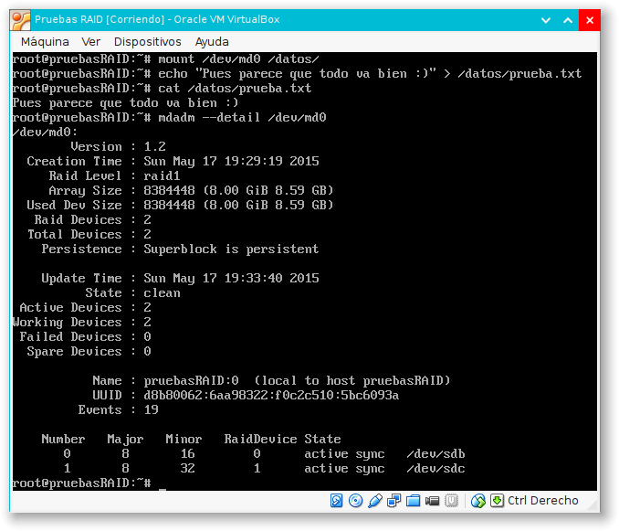
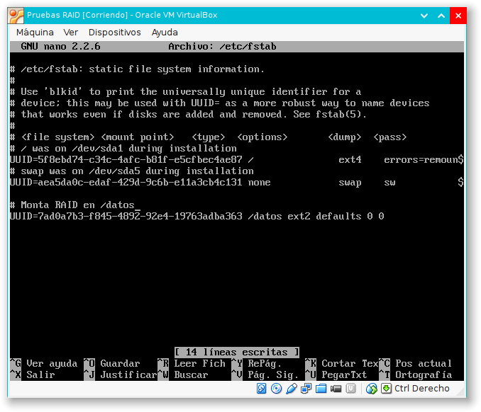
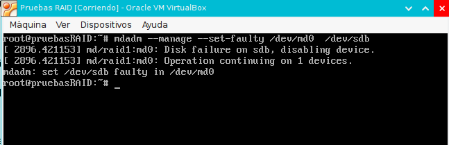
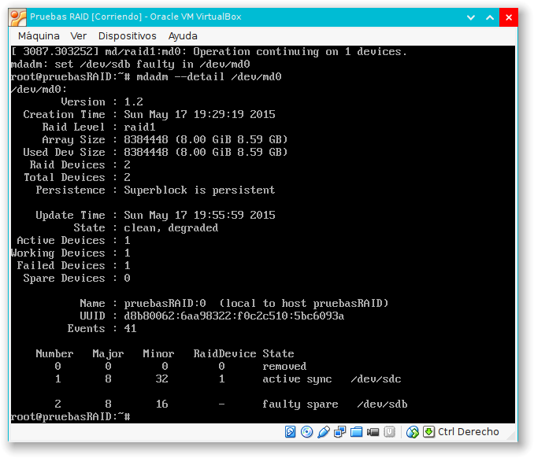
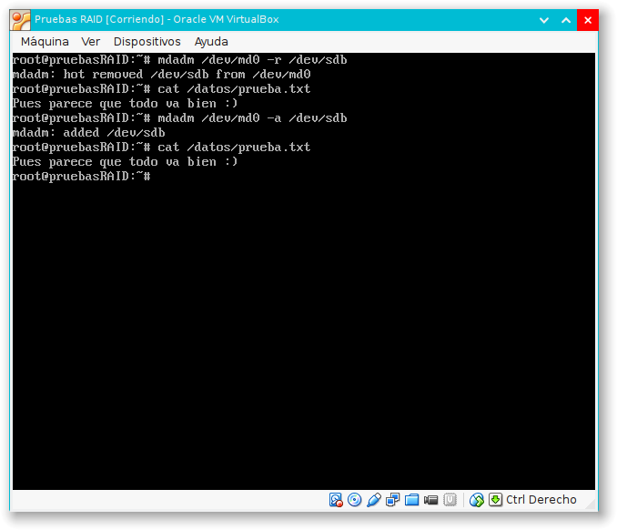

#Práctica 6


##Máquina virtual y discos duros
Por seguridad, crearemos una nueva máquina virtual para realizar esta práctica. Podemos, por ejemplo, clonar una de las dos máquinas servidoras finales, o bien crear una nueva desde cero e instalar Ubuntu Server. En nuestro caso, lo haremos de la primera forma. Llamamos a esta nueva máquina `Pruebas RAID`

Una vez clonada y antes de iniciarla por primera vez, agregamos dos discos duros adicionales a la máquina. En Virtual Box, pinchamos con el botón derecho sobre nuestra nueva máquina y pinchamos `Configuración` en el menú contextual que aparece. En la pestaña de `Almacenamiento` pinchamos sobre el segundo icono azul que hay a la derecha de `Controlador: SATA` en la sección `Árbol de almacenamiento`.



Nos aseguramos de pinchar en `Crear nuevo disco` y nos saldrá una serie de cuadros de diálogo en los  que podemos dejar todas las opciones por defecto, excepto el nombre, que elegimos el que queramos. En nuestro caso: Disco1 y Disco2. Al terminar, tendremos dos discos adicionales en nuestra máquina `Pruebas RAID`:

	

##Instalación

Como el paquete se encuentra en los repositorios, para instalar el software de gestión del RAID basta ejecutar la siguiente orden:

```
apt-get install mdadm
```

##Configuración

Para ver los dispositivos que representan a los discos duros Disco{1,2}, ejecutamos

```
sudo fdisk -l
```



Como vemos en la salida del comando, tenemos que trabajar con los discos `/dev/sdb` y `/dev/sdc`.

Ejecutamos las siguientes dos órdenes para crear el RAID y darle formato:

```
mdadm -C /dev/md0 --level=raid1 --raid-devices=2 /dev/sdb /dev/sdc
mkfs /dev/md0
```



Creamos un directorio de montaje y montamos el dispositivo:

```
mkdir /datos
mount /dev/md0 /datos
```

Podemos crear algún archivo de prueba con una orden como 

```
echo "Pues parece que todo va bien :)" > /datos/prueba.txt
```

y comprobar el estado del RAID con

```
mdadm --detail /dev/md0
```



##Automontaje
Para automatizar el proceso de montaje cuando arranque la máquina, hay que añadir el nuevo dispositivo al archivo `/etc/fstab`.

Necesitamos saber el UUID, así que ejecutamos la orden `blkid /dev/md0`, que devuelve la información que necesitamos.

Ahora, con el UUID que hemos visto con la orden anterior, añadimos las dos siguientes líneas al archivo `etc/fstab`. Usamos la configuración más sencilla posible, que funciona como esperamos:

```
#Monta RAID en /datos
UUID=7ad0a7b3-f845-4892-92e4-19763adba363 /datos ext2 defaults 0 0
```



##Simulación de fallos

Para simular un fallo, usaremos `mdadm` como sigue:

```
mdadm --manage --set-faulty /dev/md0 /dev/sdb
```

Con esta orden, simulamos que el disco /dev/sdb está defectuoso, así que obtenemos un error:



Podemos verlo en detalle con la orden `mdadm --detail /dev/md0`, con la que vemos que el estado del disco 2 es `faulty spare`



Para eliminar el disco defectuoso, ejecutamos `mdadm /dev/md0 -r /dev/sdb`. Vemos que no hemos perdido ningún dato imprimiendo el contenido del archivo `/datos/prueba.txt` que creamos antes.

En un escenario real, cuando el disco hubiera sido arreglado o sustituido, lo añadiríamos con la orden `mdadm /dev/md0 -a /dev/sdb`. Podemos volver a imprimir nuestro archivo de prueba y sonreír: parece que todo va bien.




----
Alejandro García Montoro.