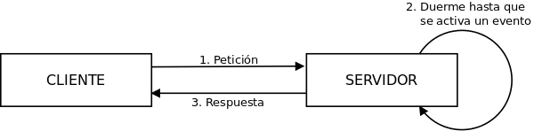
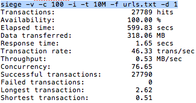
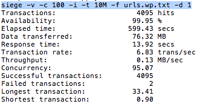
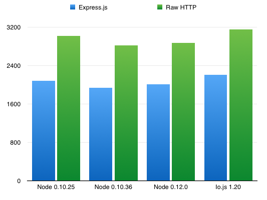

*node.js*, una nueva forma de servir
========================================================================

========================================================================

# ¿Qué es *node.js*?

*node.js* es un entorno de programación basado en JavaScript y que se ejecuta sobre V8, el motor de código abierto para JavaScript creado por Google.

### Espera, ¿V8?, ¿eh?

V8 es un motor para JavaScript; esto es, un programa que interpreta código JavaScript y lo ejecuta. Piensa en Google Chrome o en cualquier otro navegador: ¿cómo ejecuta el código JavaScript en el cliente?, ¿cómo es posible que lo haga *tan* rápido?

Ese fue exactamente el propósito de quienes diseñaron V8: crear un intérprete que ejecutara código JavaScript y, sobre todo, que lo hiciera *realmente* rápido. Escrito en C++ y optimizado hasta límites que hasta su aparición no se esperaban, V8 es el motor sobre el que está construido Google Chrome. Así que si alguna vez te preguntas por la razón de la velocidad del navegador estrella de Google, piensa en V8: tendrá gran parte de culpa en la construcción de la respuesta.

### node.js, V8 y la ultravelocidad

Pero volviendo a nuestro tema central, ¿cómo usa *node.js* V8 si es un motor hecho para un navegador? Pues porque no está hecho para un navegador, claro, sino que es un motor que se puede ejecutar de forma autónoma o incluyéndolo en cualquier aplicación en C++. Quizás este es uno de los puntos críticos a la hora de considerar el gran impacto -aunque quizás invisible al usuario final- que ha tenido este motor en el mundo web.

Teniendo en cuenta la velocidad de ejecución de V8 y el potencial que JavaScript estaba desarrollando en el lado del cliente, a Ryan Dahl, su creador, se le ocurrió en 2009 que por qué no usar el mismo lenguaje de programación en las aplicaciones de servidor que el que se usaba en aquellas que se ejecutaban tan bien en el cliente.

Así, con el propósito de facilitar la tarea a los programadores y unificar de alguna forma desarrollo cliente y servidor en una aplicación web, nació *node.js*, un entorno de programación que permite usar código JavaScript en el servidor.

### ¿Y qué dice StackOverflow que es *node.js*?

StackOverflow, templo de culto desde que Ada Lovelace decidiera inventar la programación, da una definición precisa de las características de *node.js*. Y no lo hace con una respuesta, sino con una pregunta que aclara muchos conceptos. A continuación se reproduce la parte central de lo que su autor considera [una pregunta](http://stackoverflow.com/questions/5062614/how-to-decide-when-to-use-*node.js*) y que este otro autor considera la mejor definición publicada en internet, con una traducción muy libre de lo que allí se escribió:

*node.js*

* es una herramienta de línea de comandos que puede ser usada como un servidor web y que permite a sus usuarios ejecutar código JavaScript con algo tan sencillo como `node helloWorld.js`
* usa el magnífico motor V8 JavaScript
* es adecuado cuando se quieren hacer varias cosas a la vez
* está basado en eventos, así que toda la programación tipo AJAX se puede hacer en el lado del servidor
* permite compartir código entre el navegador y el servidor
* permite interactuar con MySQL

Sabemos ya qué es *node.js*, algunas de sus características y sus fundamentos básicos pero, ¿qué lo diferencia de los demás?

# JavaScript en el servidor

Apache, ISS, nginx... Hay miles de alternativas en el mundo de los servidores, bien asentadas tras años de desarrollo y con una comunidad detrás que resuelve cualquier problema en menos de lo que se tarda en escribir `service httpd restart`.

¿Por qué elegir *node.js* entonces? Y, sobre todo, ¿cuándo usarlo?

## Estrategia de respuesta en el servidor

### Petición - respuesta
La mayoría de servidores, como Apache, tienen un objetivo claro: responder a cada petición en el menor tiempo posible. La estrategia de este tipo de servicios es clara: por cada petición que llega, se responde inmediatamente a ella. El usuario, feliz, recibe su respuesta cuanto antes. El problema de esta estrategia es la escalabilidad y el paralelismo en el lado del servidor. No en vano una de las características que antes se remarcaron de *node.js* es su adecuación a escenarios donde se quiere hacer varias cosas a la vez.


### Petición - evento - respuesta
*node.js*, por su parte, sigue otra estrategia cuando llega una petición. En vez de contestar inmediatamente a ella, pone a trabajar al encargado de la tarea que se necesita realizar y se olvida de su existencia. Hasta que aquel encargado no le notifica con un evento de que está terminada, no se envía la respuesta. Esto se conoce como *event-driven programming*, algo así como programación dirigida por eventos, y es algo muy usado en JavaScript y en entornos AJAX.



Esta estrategia es la gran ventaja de *node.js*, que la hace idónea para aplicaciones web que

* mantengan una conexión persistente entre cliente y servidor,
* compartan código entre cliente y servidor,
* necesiten una estrategia dirigida a eventos o
* hagan uso de una gran concurrencia y/o paralelismo.

Así, aplicaciones interesantes para implementar con node.js serían:

* Juegos online
* Herramientas colaborativas
* Salas de chat

En general, cualquier aplicación que necesite informar a todos los usuarios de lo que está haciendo cada uno de ellos es un buen ejemplo de dónde usar *node.js*.

## *Long polling*

Relacionado con la anterior discusión, es necesario hablar del *long polling*, una técnica que es especialmente interesante en *node.js* y que hace de este sistema uno de los vencedores absolutos en algunos de los estudios que veremos más adelante.

### *Polling*
*Polling* es una técnica relacionada con escenarios de E/S que consiste en mantener al cliente preguntando al servidor constantemente por la respuesta que pidió.

Como ejemplo, podemos pensar en un ordenador que envía varios documentos a una impresora. Hasta que el primero no se ha terminado de imprimir, el ordenador no puede mandar el segundo. Como el canal de comunicación es `ordenador->impresora`, es el ordenador el que tiene que estar constantenmente preguntando a la impresora si está lista.

Así, cuando en una de esas múltiples peticiones la impresora responde que ya puede recibir el segundo documento, el ordenador abre un canal de comunicación y envía el segundo documento.

De forma general, podríamos ver esta técnica como sigue:

1. El cliente hace una petición.
2. El servidor responde inmediatamente. Si la respuesta no estaba disponible, envía una respuesta vacía y obliga al cliente a realizar una nueva petición.

Como vemos, en esta técnica es siempre el cliente el que inicia la comunicación y el que se encarga de saber si su respuesta está lista. Este tipo de estrategias se engloban el en tipo *pull*.

### *Long polling*
En el lado opuesto de las técnicas de comunicación se encuentran las que se llaman estrategias *push*, en las que es el servidor el que inicia la comunicación.

Pero en medio tenemos una técnica muy interesante: la técnica long-polling. Es un derivado del *polling* que intenta simular las técnicas *push* para mantener las comunicaciones. Funciona de la siguiente manera:

1. El cliente hace la petición como en *polling*, pero con una frecuencia muchísimo menor.
2. El servidor, si no tiene nada que ofrecer cuando recibe la petición, no envía una respuesta vacía. En vez de eso, mantiene el canal de comunicación abierto hasta que la respuesta está disponible.
3. Cuando la respuesta está disponible, se envía al cliente.

Así, se elimina el tiempo que transcurre en *polling* entre que la respuesta está disponible y la siguiente petición del cliente. Además, se alivia la carga del cliente y del servidor, que no tienen que procesar tantas peticiones/respuestas como en *polling*.

Esta técnica, usada con programación asíncrona del lado del cliente, es capaz de crear aplicaciones web realmente rápidas que no sobrecarguen ni navegador ni servidor.

Es claro, además, el paralelismo entre estas dos técnicas y las estrategias de respuesta en el servidor que vimos un poco más arriba. *Long polling* es, por tanto, la forma natural de trabajar con *node.js*.

## ¿Por qué usar node.js?

Tras haber visto todas estas características de *node.js*, llega la gran pregunta: ¿por qué tendría yo que usarlo?

Una búsqueda rápida en Google te devolverá mil fanáticos que te harán creer que sin *node.js*, el Amado Líder, ya no podrás vivir.

Aunque algunas de esas opiniones están exageradas y no son nada parciales, en [este estudio](https://thomashunter.name/blog/php-vs-nodejs/) de *node.js* y PHP encontramos un breve listado más o menos objetivo de las ventajas que supone usar *node.js*, y que aquí reproducimos:

1. *node.js* es dirigido por eventos: esto permite una forma de programar que se adapta muy bien a la web.
2. *node.js* tiene un servidor web ya implementado
3. *node.js* tiene un magnífico gestor de paquetes: npm

# Benchmarking

## node.js contra Apache+PHP, ¡primer asalto!

A la hora de decidir entre entornos de programación, las variables a tener en cuenta son numerosas. Herramientas tan nuevas como *node.js* pueden ser atractivas en un primer momento, e incluso llegar a desbancar a gigantes como Apache+PHP en el lado del servidor. ¿Pero es una decisión acertada? Y, de hecho, ¿son comparables ambas herramientas?

Em el estudio antes referenciado se da también un listado de qué entorno escoger según lo que se quiera desarrollar o cómo se pretenda hacerlo. Esta lista no es completa ni hay que seguirla a raja tabla, pero da una idea de que, en realidad, *node.js* no viene a desbancar a Apache+PHP sino a complementarlo.

|                                                                         | node.js | PHP |
|------------------------------------------------------------------------:|:-------:|:---:|
|                                               Web de contenido estático |         |  :) |
|                               Aplicación cuyos usuarios comparten datos |    :)   |     |
|                 ¿Quieres aprender realmente el modelo cliente-servidor? |         |  :) |
|                     Aplicación que necesita ejecutar código en paralelo |    :)   |     |
|                          Aplicación ejecutada en servidores compartidos |         |  :) |
| Aplicación que necesita de la técnica *push* (a través de *websockets*) |    :)   |     |
|                                                          ¿Sabes PHP ya? |         |  :) |
|                                                      ¿Sabes JavaScript? |    :)   |     |
|                                             Script de línea de comandos |    :)   |  :) |

Pero vayamos a los números. En este otro estudio de [LoadImpact](http://blog.loadimpact.com/blog/node-js-vs-php-using-load-impact-to-visualize-node-js-efficency/) se compara el rendimiento de un servidor que ejecuta un script muy sencillo tanto en *node.js* como en Apache+PHP. Se reproducen a continuación las dos gráficas obtenidas, la primera de *node.js* y la segunda de Apache+PHP.


Leyenda:

* Línea verde: número de usuarios concurrentes.
* Línea azul: tiempo de respuesta en milisegundos.
* Línea roja: porcentaje de uso de la CPU.

Como vemos, pasado un número de usuarios concurrentes, Apache+PHP empieza a perder eficiencia de una manera casi exponencial, llegando a tardar 10 segundos en responder una petición. Mientras tanto, *node.js* ni se inmuta, manteniendo un tiempo de respuesta constante de unos 200 milisegundos.

¿Quiere decir esto que *node.js* es perfecto? Evidentemente, no. Hay muchas cosas que no se han tenido en cuenta en este test, dejando a *node.js* en clara ventaja, ya que si analizamos las características técnicas del test vemos que no se hace uso, por ejemplo, de la capacidad de Apache+PHP de ejecutarse sobre varios núcleos de forma paralela.

## node.js contra Apache+PHP, ¡segundo asalto!
[Este otro estudio](http://blog.appdynamics.com/nodejs/an-example-of-how-node-js-is-faster-than-php/) analiza un caso mucho más cercano a la realidad, midiendo la eficiencia de dos gestores de blogs:

1. [Ghost](https://ghost.org/), implementado en *node.js*
2. Wordpress, implementado en PHP.

Esta vez no se usa node.js como un servidor en sí, sino que la aplicación Ghost se ejecuta tras el servidor nginx, mientras que *Wordpress* funciona tras Apache. El benchmark se hace con Siege, y los resultados son los siguientes -primera imagen, *Ghost*; segunda imagen, Apache-:




Como vemos, *Ghost* supera a *Wordpress* de una manera espectacular, teniendo el primero un tiempo medio de respuesta de 1,65 segundos y el segundo de 13,92. La diferencia es aún más abismal cuando nos fijamos en el tiempo máximo de respuesta: 2,62 segundos frente a 33,41.

De nuevo, ¿quiere esto decir que *node.js* es mejor que PHP? No. Estos datos sólo apuntan a que, en ese test, analizando dos aplicaciones de blogs sobre diferentes tecnologías, la ganadora es la que está escrita sobre *node.js*. Pero todos sabemos que la correlación no implica causalidad, ¿no? :)

Hay [otros](http://www.infoworld.com/article/2866712/php/php-vs-node-js-an-epic-battle-for-developer-mind-share.html) [muchos](http://www.hostingadvice.com/blog/comparing-node-js-vs-php-performance/) [estudios](http://zgadzaj.com/benchmarking-nodejs-basic-performance-tests-against-apache-php) que comparan *node.js* con PHP, pero hagámoslo competir contra un tipo de su tamaño...

## *node.js* contra *io.js*, ¡la lucha del siglo!
Que *node.js* sea tan nuevo no quiere decir que ya tenga alumnos aventajados. [*io.js*](https://iojs.org/en/index.html) es un entorno basado en *node.js* -nació, de hecho, como un fork suyo-, compatible también con *npm*, que lucha por su huequito en el mundo de los servidores.

En esta [web](https://raygun.io/blog/2015/02/node-js-performance-node-js-vs-io-js/) comparan ambos entornos -en el caso de *node.js*, se comparan también varias versiones del mismo-, analizando simplemente el número de peticiones por segundo que es capaz de procesar cada uno de los servidores. Los resultados se resumen en la siguiente gráfica:



A la vista de la gráfica podemos concluir que este asalto lo pierde el hasta ahora invicto *node.js*, dejando hueco a los que ya le siguen, como *io.js*.

## *node.js* contra Java EE, ¿quién ganará esta vez?
Para terminar esta ronda de comparaciones analizamos [este estudio de Marc Fasel](http://blog.shinetech.com/2013/10/22/performance-comparison-between-node-js-and-java-ee/), que enfrenta un servlet de Java servido por Apache con la misma aplicación implementada íntegramente en *node.js*. 

La tabla siguiente corresponde a la aplicación implementada en *node.js*

| Peticiones concurrentes | Tiempo medio de respuesta (ms) | Peticiones por segundo |
|-------------------------|--------------------------------|------------------------|
| 10                      | 19                             | 509                    |
| 50                      | 109                            | 453                    |
| 100                     | 196                            | 507                    |
| 150                     | 294                            | 506                    |

Los siguientes resultados corresponden al servlet de Java servido por Apache:

| Peticiones concurrentes | Tiempo medio de respuesta (ms) | Peticiones por segundo |
|-------------------------|--------------------------------|------------------------|
| 10                      | 23                             | 422                    |
| 50                      | 119                            | 416                    |
| 100                     | 243                            | 408                    |
| 150                     | 363                            | 411                    |

Vemos cómo *node.js* vuelve a ganar, de nuevo, a su contricante. Java EE tras Apache tiene, con cualquier número de peticiones concurrentes, un tiempo medio de respuesta mayor que el de *node.js*, que es un alrededor de un 20% más rápido que los servlets.

Este test, sin embargo, es incluso más parcial que los anteriores. La aplicación testeada -una lectura de datos JSON de una base de datos CouchDB- tiene una gran cantidad de E/S, operaciones para las que *node.js* está especialmente indicado. Por lo tanto, de nuevo, hay que tomar los resultados con precaución.

## Conclusión
Parece que *node.js* vence a Apache+PHP en casi todos los benchmarks, a los servlets de Java en [muchos](http://www.reddit.com/r/java/comments/1wxe8n/is_nodejs_really_faster_than_java/) de ellos y pierde en un pequeño test contra *io.js*. Hay [otros estudios](http://www.techempower.com/benchmarks/#section=data-r8&hw=i7&test=db&l=ao&p=4zsqx-2&w=ei&f=zg24n3-zijxtr-zik0zj-0) que contemplar y otras estadísticas a tener en cuenta, como el [porcentaje de uso de cada servidor](http://w3techs.com/technologies/comparison/ws-apache,ws-microsoftiis,ws-nodejs), pero parece que *node.js* tiene una gran proyección, al menos en aplicaciones que se adecúen a sus características.

La discusión está servida, y al lector queda concluir qué tecnología decide usar para las aplicaciones que implementa.

# Instalación y uso

Instalar *node.js* es tan fácil como decirle a tu gestor de paquetes que lo haga. En mi caso (Arch Linux), bastó ejecutar la siguiente orden:

```
pacman -S nodejs npm
```

En Debian/Ubuntu y derivadas, hay que añadir el repositorio e instalarlo:

```
curl -sL https://deb.nodesource.com/setup | sudo bash -
sudo apt-get install -y nodejs
```

En RedHat/CentOS/Fedora y derivadas es similar:

```
sudo yum install nodejs npm
```

Hay gente que incluso usa Gentoo, así que por qué no indicar aquí la instalación:

```
emerge nodejs
```

Para el resto de distribuciones, *node.js* tiene una [página](https://github.com/joyent/node/wiki/Installing-Node.js-via-package-manager) en su repositorio de GitHub donde indican todos los pasos necesarios en todas las distribuciones imaginables, ¡hay incluso instrucciones para Windows!

## ¿Hola, mundo?

Bueno, pues ya tenemos *node.js* y su gestor de paquetes, npm, instalados. Así que... ¿hacemos un holamundo?

Guarda el siguiente script en un archivo que se llame `holaHolitaVecinito.js`:

```javascript
var http = require('http');

http.createServer(function (req, res) {
  res.writeHead(200, {'Content-Type': 'text/plain'});
  res.end('Hola holita, vecinito :)\n');
}).listen(8124, "127.0.0.1");

console.log('Server running at http://127.0.0.1:8124/');
```

Ahora, en el directorio en el que esté guardado, ejecuta

```
node holaHolitaVecinito.js
```

Por último, desde tu navegador accede a la URL `http://127.0.0.1:8124/`. Et... voilà! Tras un largo recorrido de **seis líneas de código**, tenemos un servidor ejecutándose de forma local, al que podemos acceder desde el navegador, ¡y que nos saluda!

# Tecnologías amigas

*node.js*, por sí solo, puede hacer algunas cosas pero no todas las que querríamos. A su alrededor se ha creado todo un universo de paquetes, bibliotecas y frameworks que permiten a los desarrolladores crear aplicaciones con facilidad y rapidez. De entre ellas las más importantes son:

* **express**: Framework construido sobre *node.js*, añade muchas funcionalidades y una extensa API.
* **meteor**: Plataforma construida sobre *node.js*, que permite crear aplicaciones web y móvil en JavaScript.
* **io.js**: Fork de *node.js* con su mismo objetivo: convertirse en el servidor de facto de las aplicaciones web.
* **socket.io**: Biblioteca de JavaScript para comunicación bidireccional en tiempo real.